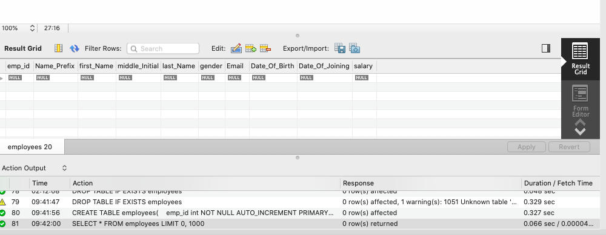
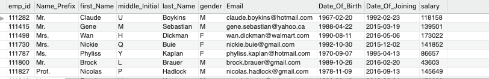

# Employees Data Migration Project by Emmanuel Obafemi Buraimo

 This software receives SQL queries that insert data into a MYSQL Database and persistes them. This happens wither with the use of Threads or withou them, the time taken for both is calculated and displayed.
 Below are the User stories created during the development of the program


## User Stories
* As a user I would like to insert data into the Database.

* As a User I would also like to see the time taken to perform this both using threads and not.

## Code Snippets

Found below are snippets of code along with a brief explanation of what they do in this program to achieve the requests of the user stories.

```java
public Connection connectToDatabase()

    {
        try
        {

            properties.load(new FileReader("resources/login.properties"));
            connection = DriverManager.getConnection(URL, properties.getProperty("username") , properties.getProperty("password"));

        } catch (FileNotFoundException e) {
            e.printStackTrace();
        } catch (IOException e) {
            e.printStackTrace();
        }
        catch(SQLException throwables)

        {
            throwables.printStackTrace();
        }
        return connection;
    }
      
  ```


This code esablishes the connection with the MYSQL server and by connecting with the username and password.


```java
 public void addEmployees(HashMap<Integer, EmployeeDTO> theEmployees)  {
        connectToDatabase();
        try {
            PreparedStatement statement = connection.prepareStatement(insertEmployees);
            int i = 1;


            for (EmployeeDTO employee : theEmployees.values()) {
                statement.setInt(1, employee.getEmployeeId());
                statement.setString(2, employee.getName_Prefix());
                statement.setString(3, employee.getFirst_Name());
                statement.setString(4, employee.getMiddle_initial());
                statement.setString(5, employee.getLast_Name());
                statement.setString(6, employee.getGender());
                statement.setString(7, employee.getEmail());
                statement.setDate(8, Date.valueOf(employee.getDob()));
                statement.setDate(9, Date.valueOf(employee.getDoj()));
                statement.setInt(10, employee.getSalary());
                statement.addBatch();
                if (i == theEmployees.size()) {
                    statement.executeBatch();
                    connection.commit();
                }
                i++;

            }
        } catch (SQLException e) {
            e.printStackTrace();
        }

    }
   ```
    
    
    
    
    
This code sets the values for all the respective fields received from the CSV file and sets them accordignly. Getters and Setter methods have also all been included to receive single information about the users.


```java
 public void readingData() {

        String textToRead = "resources/EmployeeRecords.csv";

        try (BufferedReader buffer = new BufferedReader(new FileReader(textToRead))) {
            buffer.readLine();
                String line = "";
            while ((line = buffer.readLine()) != null) {
                EmployeeDTO employee = new EmployeeDTO(line.split(","));
                databaseInfo.put(employee.getEmployeeId(), employee);
                duplicates.add(employee);


            }
            System.out.println(databaseInfo.size());
        } catch (FileNotFoundException e) {

        } catch (IOException e) {
            e.printStackTrace();
           // myLog.logException(e);
        }
        myLocalDAO.addEmployees(databaseInfo);
         lengthOfTime = System.nanoTime() - start;

            printTime(lengthOfTime);

    }
   ```
And finally this piece of code adds these data from the CSV files into a HashMap and in turn the HASHMAP sends the data to the database. Duplicate values within the CSV files are stored in a set the size of which is 57.
     
     
## Screenshots Of Insertion


Now the image below is the result after running the program with either the threads or without threads



## Sprint Retrospective

I believe at the end of the development of this program the MVP the minimum viable product was met as the data from the CSV has been inserted into the database, but additonal funcionality should be added for other operations such as retriving data, deleting and updating which will also add to the amount of user stories created, and also testing to ensure they're working as they're supposed to. This will be added to improve the software.


     


    
     
    
     
   
   
   
   
   
   
   
   
   
   
   
   
   
   
   
   
   
   
   
   
   
   
